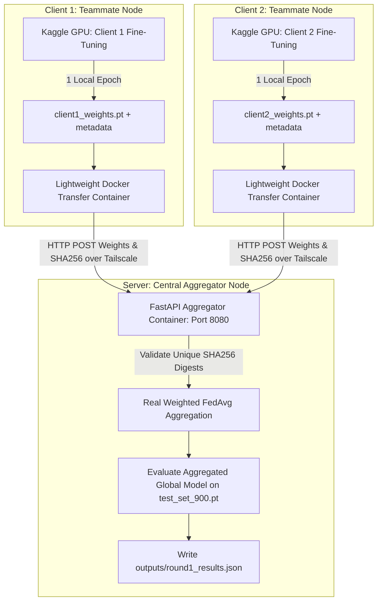

# 🏥 Federated Medical AI System: Chest X-Ray Pneumonia Detection

A privacy-preserving Federated Learning system designed for medical diagnostic imaging. Trains deep convolutional networks (ResNet-18) across decentralized hospital client nodes on the RSNA Pneumonia Detection Challenge DICOM dataset without sharing patient raw X-ray data.

---

## 🏗️ System Architecture



---

## 📊 Benchmark Results Matrix

> [!NOTE]
> All metrics below reflect real, empirical GPU evaluations on the patient-disjoint 900-patient held-out test set ($N=900$).

| Milestone / Strategy | System Topology | Test ROC-AUC | Test Recall (Sens) | Test Specificity | Test F1-Score | Test Precision | Status |
| :--- | :--- | :--- | :--- | :--- | :--- | :--- | :--- |
| **Step 5 Centralized Baseline** | Centralized GPU | **0.8536** | **0.8173** | **0.7384** | **0.6082** | **0.4843** | Verified Upper Bound |
| **Step 10 Standard FedAvg** | 5 Dirichlet Clients ($\alpha=0.5$) | **0.8291** | **0.0865** | **0.9783** | **0.1494** | **0.5455** | Verified Non-IID Drift |
| **Step 11 FedProx ($\mu=0.1$)** | 5 Dirichlet Clients ($\alpha=0.5$) | **0.8249** | **0.2067** | **0.9538** | **0.3094** | **0.6230** | Verified Mitigation |
| **Live Multi-Machine Round** | 2 Real Compute Origins | `PENDING` | `PENDING` | `PENDING` | `PENDING` | `PENDING` | **PENDING — not yet executed** |

---

## 📂 Repository Structure

```text
federated-medical-ai/
├── data/                    # Pre-extracted test set (test_set_900.pt)
├── docker/
│   ├── client/              # Lightweight non-torch client weight transfer container
│   │   ├── Dockerfile
│   │   ├── client_transfer.py
│   │   └── requirements.txt
│   └── server/              # Real FedAvg FastAPI aggregation server
│       ├── Dockerfile
│       ├── server_aggregator.py
│       └── requirements.txt
├── docs/
│   ├── SERVER_SETUP.md      # Server owner setup and execution guide
│   └── TEAMMATE_SETUP.md    # Teammate client execution guide (zero Python required)
├── kaggle_notebooks/        # Reproducible Kaggle GPU T4 notebooks
│   ├── export_test_set.ipynb
│   ├── kaggle_step5_baseline.ipynb
│   ├── kaggle_step6_imbalance.ipynb
│   ├── kaggle_step7_gradcam.ipynb
│   ├── kaggle_step10_fedavg.ipynb
│   ├── kaggle_step11_fedprox.ipynb
│   ├── kaggle_client1_train.ipynb
│   └── kaggle_client2_train.ipynb
├── outputs/                 # Evaluation JSON results, confusion matrices, plots
├── weights/                 # Client state_dict tensors and metadata files
├── .env.example             # Template for Tailscale environment variables
├── .gitignore               # Strict gitignore rules
└── README.md                # Project documentation
```

---

## 🚀 Quick Execution Links

- **Server Owner Setup**: Refer to [`docs/SERVER_SETUP.md`](docs/SERVER_SETUP.md) for server aggregator launch steps.
- **Teammate / Client Setup**: Refer to [`docs/TEAMMATE_SETUP.md`](docs/TEAMMATE_SETUP.md) for lightweight client weight submission steps.

---

## 🩺 Clinical Demonstration Service & Doctor UI (Port 8090)

A standalone single-image inference service and zero-build web interface for interactive pneumonia screening:

- **Service Module**: [`app/inference_server.py`](app/inference_server.py) (Running on Port `8090`, isolated from the Port `8080` FL Aggregator).
- **Web Interface**: Single-page Doctor UI accessible at `http://localhost:8090/` (located at [`app/static/doctor_ui.html`](app/static/doctor_ui.html)). Supports `.dcm` (DICOM), `.png`, `.jpg`, and `.jpeg`.
- **Launch Command**:
  ```bash
  python app/inference_server.py
  # Or via Uvicorn:
  uvicorn app.inference_server:app --host 0.0.0.0 --port 8090
  ```

### Active Model Checkpoint & Rationale
- **Default Checkpoint**: Step 5 Centralized Baseline (`best_baseline_model.pt` / `best_model.pt`, verified Test ROC-AUC: **0.8536**).
- **Explicit Checkpoint Policy**: We intentionally **do not** default to the Step 12b federated aggregated model. The Step 12b model has only completed a single round of training across two positive-skewed partitions (57.0% and 29.8% positive rate) and its out-of-distribution generalization has not yet been verified on the test set. The Step 5 baseline represents our empirical, verified performance standard.
- **Fail-Loud Startup Validation**: Configured via the `MODEL_CHECKPOINT_PATH` environment variable. If the specified checkpoint file is missing, the server **fails loudly on startup** and terminates immediately to prevent operating with random weights.

### Known Limitations & Regulatory Status
> [!CAUTION]
> **TECHNOLOGY DEMONSTRATION ONLY — NOT A CLINICAL TOOL**
> - **Regulatory Notice**: This software is an investigational research prototype. It is **not** an FDA-cleared, CE-marked, or CDSCO-approved medical device and must **never** be used for direct patient diagnostic or clinical decision-making.
> - **Recall Ceiling**: Even the best verified model (Step 5 baseline) exhibits an empirical test recall ceiling of ~81.7%, meaning approximately 18% of positive pneumonia cases can be missed under a 0.5 decision threshold.
> - **Federated Model Generalization**: The generalization capability of the live FL-aggregated model remains unknown until multi-round live trials are conducted and verified against the held-out test set.
> - **Data Privacy**: Uploaded patient image bytes are preprocessed strictly in memory and are **never** persisted to disk. Each prediction is recorded with a timestamp, filename, and score payload in `outputs/inference_log.jsonl` for audit compliance.

